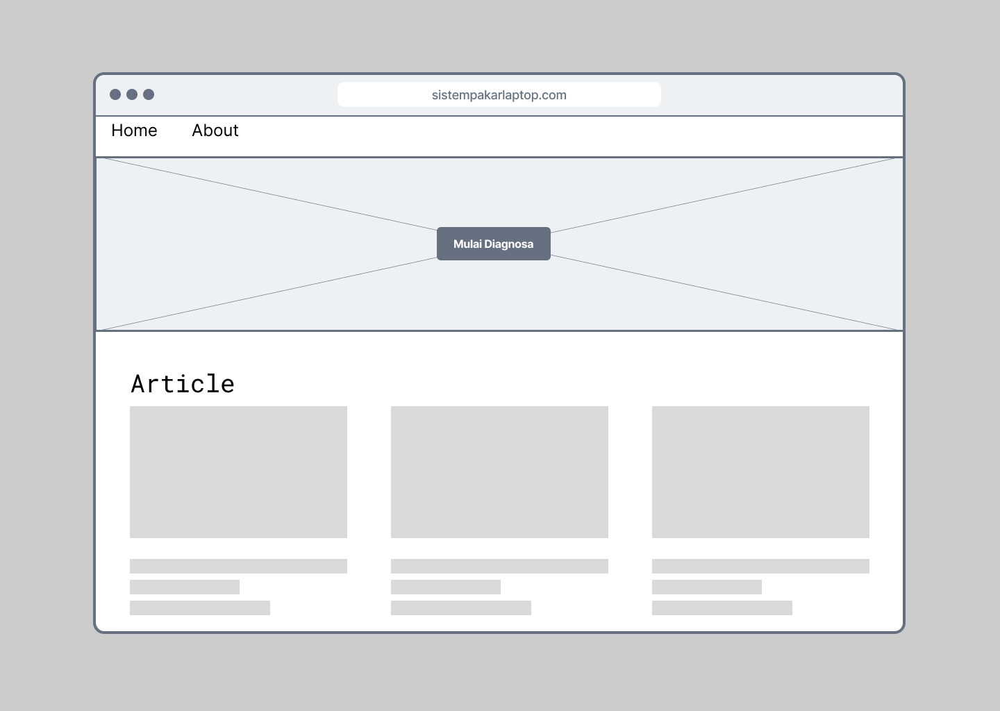

# Sistem Pakar

---

## Stack

Project ini dibuat dengan standard tech 2023 starter kit t3-stack

### Umum

1. Framework Full Stack Nextjs
2. Database Postgresql
3. Bahasa Typescript

### Just FYI

4. Postgresql by supabase (penyedia postgres cloud gratis )
5. tRpc
6. Tailwindcss
7. NextAuth & OAuth (untuk login with google, github, atau facebook dll)
8. Prisma ORM Database

## Mockup

1. Landing Page
   
2. Detail Article Page
   !(Detail Article.png)
3. Form Page
   !(Form.png)
4. Result Page
   !(Hasil Diagnosa.png)
5. All Master
   !(Master Kasus.png)
   !(Master Gejala.png)
   !(Master User Admin.png)
   !(Add or Edit Kasus.png)
   !(Add or Edit Gejala.png)

## Schema Database

!(ERD.svg)

## UML

### Use Case Diagram

!(UML - Use Case Diagram.png)
